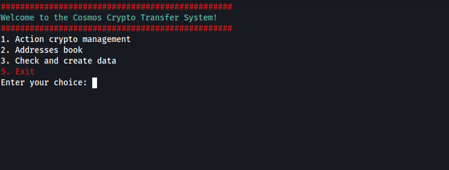
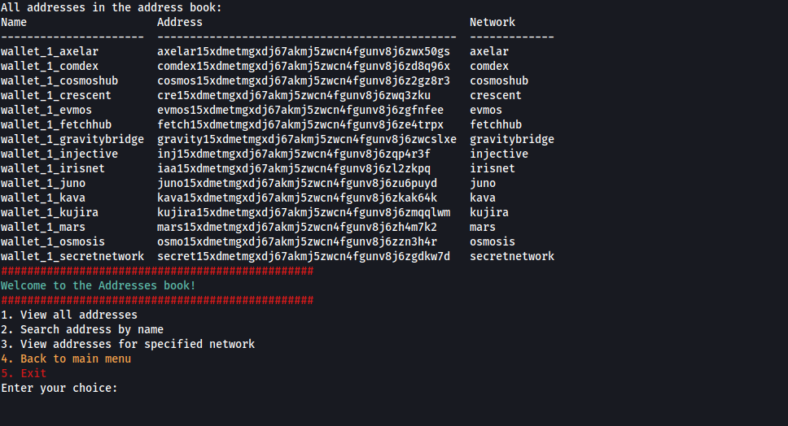
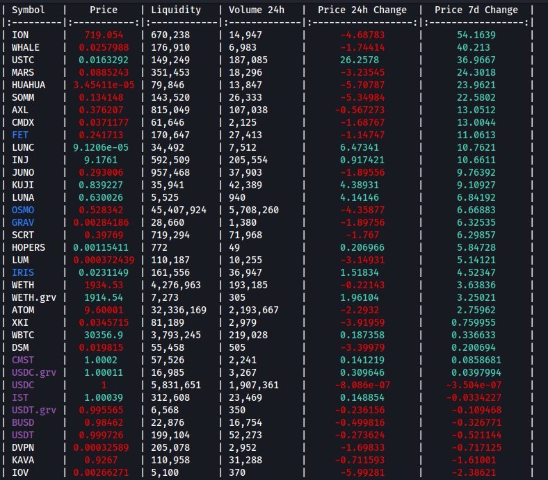
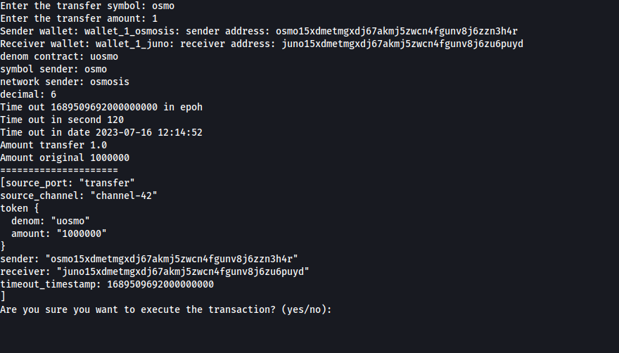
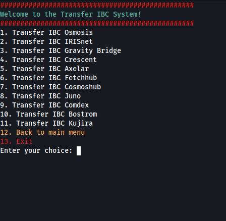

# cosmos-crypto-transfer

CLI for **IBC token transfers** across Cosmos chains, balance checks, and address book management. Uses a **time-based timeout** (default 120 seconds) instead of a block-height timeout, which is often better for arbitrage than typical wallets.

## Screenshots

Main menu:



Address book:



Osmosis DEX token info:



Actions menu:



IBC transfer:



## Repository vs local data

| Path | Contents |
|------|----------|
| `./source/` (inside repo, gitignored) | address book, client mapping, chain-registry clones, logs |
| `~/.market_ai_secrets/cosmos-crypto-transfer/` | **KeePass vault** — `wallet.kdbx`, `wallet.key`, `master.password` |

The mnemonic is stored **only** in the encrypted KeePass database. Copy `wallet.key` and `master.password` from a USB stick when you trade; delete those two files locally when idle. The database file can stay on disk (it remains encrypted).

Override the secrets folder name with `MARKET_AI_SECRETS_SLUG` (default: `cosmos-crypto-transfer`).

```
cosmos-crypto-transfer/          ← git repo
├── source/                      ← local data (.gitignore)
│   ├── data/
│   └── chain-registry/
└── ...

~/.market_ai_secrets/
└── cosmos-crypto-transfer/      ← never in git
    ├── wallet.kdbx
    ├── wallet.key
    └── master.password
```

## Requirements

- Linux
- Python 3.10+
- Git, pip

## Install

```bash
git clone <repo-url> cosmos-crypto-transfer
cd cosmos-crypto-transfer

python3 -m venv .venv
source .venv/bin/activate
pip install -r requirements.txt

python -m unittest discover -s tests -v   # no mnemonic required
```

## First run

**CLI:**

```bash
python menu_crypto.py
```

**GUI** (tkinter, Linux desktop):

```bash
# Debian/Ubuntu if tkinter is missing:
# sudo apt install python3-tk

python gui_crypto.py
```

The GUI provides the same flows as the CLI: setup, IBC transfer (with preview and confirmation), balances, address book, and Osmosis token prices.

| GUI tab | Purpose |
|---------|---------|
| Home | Status of `wallet.json`, generated clients, address book |
| IBC Transfer | Pick route from `ibc_routes.json`, preview, confirm amount, send |
| Balances | Query all balances from the address book |
| Address book | Browse / filter saved addresses |
| Osmosis tokens | Token prices from Osmosis DEX API |
| Setup | Same steps as CLI “Check and create data”; **Run first-time setup** runs the full pipeline |
| Settings | **Dark** theme by default; switch to Light; saved in `gui_settings.json` |

Quick start (no venv):

```bash
pip3 install -r requirements.txt
python3 gui_crypto.py
# or: ./run_gui.sh
```

IBC transfers in the GUI use `prepare_ibc_transfer` / `broadcast_ibc_transfer` (no terminal prompts). CLI behaviour is unchanged.

### Local sandbox (`example/`)

The `example/` directory is **gitignored**. You can keep a working copy there (e.g. `example/cosmos-crypto-transfer/`) for experiments without affecting what is pushed to GitHub. Clone or copy the repo into `example/`, then run `python3 gui_crypto.py` from that copy; `../source` is still shared with the main tree.

Recommended flow under **“3. Check and create data”** (CLI) or the **Setup** tab (GUI):

| Step | Menu item | Action |
|------|-----------|--------|
| 1 | 1 | Create `source/`, clone chain-registry |
| 2 | 4 | Install dependencies (`requirements.txt`) |
| 3 | 6 | Build `cosmos_data_list.json` |
| 4 | 7 | Generate `chain/clients/ledger_clients.py` |
| 5 | 8 | Generate `chain/wallets/wallets_list.py` |
| 6 | 9 | Generate `source/data/address_book.json` |

Run **`python menu_crypto.py`** from the repository root; `PYTHONPATH` is set automatically.

## Secret vault (KeePass)

**GUI:** Setup → **Create / reset vault** (also offered at the start of first-time setup).

**CLI:**

```bash
python secrets_cli.py init          # create vault + key file + master.password
python secrets_cli.py status
python secrets_cli.py show          # summary only
python secrets_cli.py set           # change mnemonic
```

Files are created under `~/.market_ai_secrets/cosmos-crypto-transfer/`.

Legacy mode: plaintext `source/creds/wallet.json` still works if no vault exists (not recommended).

For chains with a non-default HD path (e.g. **Agoric**, slip44 `564`), add `"slip44": 564` to that chain’s entry in `cosmos_data_list.json` before step 8.

## Environment variables

See `.env.example`:

| Variable | Default |
|----------|---------|
| `COSMOS_PROJECT_ROOT` | directory containing `menu_crypto.py` |
| `COSMOS_SOURCE_PATH` | `../source` |
| `COSMOS_WALLET_FILE` | `source/creds/wallet.json` |

## Project layout

```
cosmos-crypto-transfer/
├── menu_crypto.py
├── gui_crypto.py           # GUI entry point
├── gui/
├── menu/
├── action_crypto/          # balances, IBC, Osmosis DEX info
├── config/
│   ├── ibc_routes.json     # IBC routes (editable)
│   └── wallet.example.json # creds template (placeholders only)
├── addresses/              # denoms_book, pools_book
├── chain/
│   ├── clients/            # ledger_clients.py — generated
│   └── wallets/            # wallets_list.py — generated
├── project_utils/
├── screen/                 # UI screenshots
└── tests/
```

## IBC routes

All routes are defined in `config/ibc_routes.json`. Example:

```json
{
  "source_network": "agoric",
  "destination_network": "osmosis",
  "sender_wallet": "wallet_1_agoric",
  "receiver_wallet": "wallet_1_osmosis",
  "channel": "channel-1",
  "gas": 200000,
  "timeout_seconds": 120,
  "client_attr": "agoric_client",
  "wallet_attr": "wallet_1_agoric_chain"
}
```

To transfer: CLI menu **1 → 4**, or GUI **IBC Transfer** tab; pick source chain and route, then symbol and amount from `denoms_book.json`.

## Tests

```bash
python -m unittest discover -s tests -v
```
